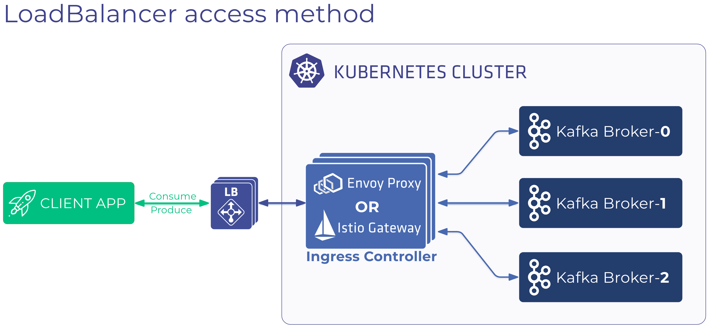
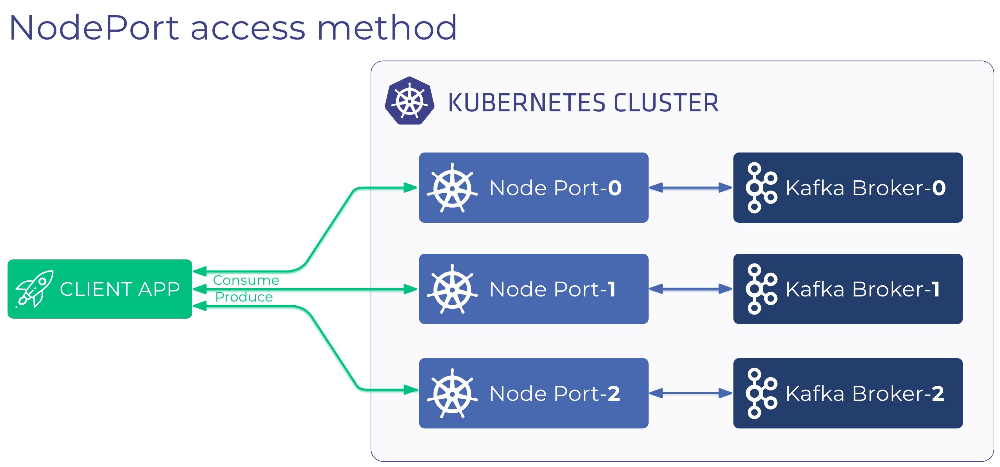

There are two methods to expose your Apache Kafka cluster so that external client applications that run outside the Kubernetes cluster can access it:

- using [LoadBalancer](#loadbalancer) type services
- using [NodePort](#nodeport) type services

The `LoadBalancer` method is a convenient way to publish your Kafka cluster, as you don't have to set up a Load Balancer, provision public IPs, configure routing rules, and so on, since all these are taken care for you. Also, this method has the advantage of reducing your attack surface, since you don't have to make the Kubernetes cluster's nodes directly reachable from outside, because incoming external traffic is routed to the nodes of the Kubernetes cluster through the Load Balancer.



The `NodePort` method provides access to Kafka for external clients through the external public IP of the nodes of the Kubernetes cluster.



This `NodePort` method is a good fit when:

- your Kubernetes distribution or hosting environment does not support Load Balancers,
- business requirements make the extra hops introduced by the Load Balancer and Ingress controller unacceptable, or
- the environment where the Kubernetes cluster is hosted is locked down, and thus the Kubernetes nodes are not reachable through their public IPs from outside.

## External listeners

You can expose the Kafka cluster outside the Kubernetes cluster by declaring one or more _externalListeners_ in the `KafkaCluster` custom resource. The following *externalListeners* configuration snippet creates two external access points through which the Kafka cluster's brokers can be reached. These *external listeners* are registered in the `advertised.listeners` Kafka broker configuration as `EXTERNAL1://...,EXTERNAL2://...`.

By default, external listeners use the [LoadBalancer](#loadbalancer) access method.

```yaml
listenersConfig:
  externalListeners:
    - type: "plaintext"
      name: "external1"
      externalStartingPort: 19090
      containerPort: 9094
      # anyCastPort sets which port clients can use to reach all the brokers of the Kafka cluster, default is 29092
      # valid range: 0 < x < 65536
      # this doesn't have impact if using NodePort to expose the Kafka cluster
      anyCastPort: 443
      # ingressControllerTargetPort sets which port the ingress controller uses to handle the external client traffic through the "anyCastPort", default is 29092
      # valid range: 1023 < x < 65536
      # this doesn't have impact if using NodePort to expose the Kafka cluster
      # if specified, the ingressControllerTargetPort cannot collide with the reserved envoy ports (if using envoy) and the external broker port numbers
      ingressControllerTargetPort: 3000
    - type: "plaintext"
      name: "external2"
      externalStartingPort: 19090
      containerPort: 9095
```

## Expose cluster using a *LoadBalancer* {#loadbalancer}

To configure an external listener that uses the LoadBalancer access method, complete the following steps.

1. Edit the `KafkaCluster` custom resource.
1. Add an `externalListeners` section under `listenersConfig`. The following example creates a Load Balancer for the external listener, `external1`. Each broker in the cluster receives a dedicated port number on the Load Balancer which is computed as *broker port number = externalStartingPort + broker id*. This will be registered in each broker's config as `advertised.listeners=EXTERNAL1://<loadbalancer-public-ip>:<broker port number>`.

> There are currently two reserved container ports while using Envoy as the ingress controller: 8081 for health-check port, and 8080 for admin port. The external broker port numbers (externalStartingPort + broker id) cannot collide with the reserved envoy ports.

    ```yaml
    listenersConfig:
      externalListeners:
        - type: "plaintext"
          name: "external1"
          externalStartingPort: 19090
          containerPort: 9094
          accessMethod: LoadBalancer
          # anyCastPort sets which port clients can use to reach all the brokers of the Kafka cluster, default is 29092
          # valid range: 0 < x < 65536
          anyCastPort: 443
          # ingressControllerTargetPort sets which port the ingress controller uses to handle the external client traffic through the "anyCastPort", default is 29092
          # valid range: 1023 < x < 65536
          # if specified, the ingressControllerTargetPort cannot collide with the reserved envoy ports (if using envoy) and the external broker port numbers
         ingressControllerTargetPort: 3000
    ```

1. Set the ingress controller. The ingress controllers that are currently supported for load balancing are:

    - `envoy`: uses Envoy proxy as an ingress.
    - `istioingress`: uses Istio proxy gateway as an ingress.

    Configure the ingress controller you want to use:

    - To use Envoy, set the `ingressController` field in the `KafkaCluster` custom resource to `envoy`. For an example, [see](https://github.com/banzaicloud/koperator/blob/672b19d49e5c0a22f9658181003beddb56f17d33/config/samples/banzaicloud_v1beta1_kafkacluster.yaml#L12).

      For OpenShift:

      ```yaml
      spec:
        # ...
        envoyConfig:
          podSecurityContext:
            runAsGroup: 19090
            runAsUser: 19090
        # ...
        ingressController: "envoy"
        # ...
      ```

      For Kubernetes:

      ```yaml
      spec:
        ingressController: "envoy"
      ```

    - To use Istio ingress controller set the `ingressController` field to `istioingress`. [Istio operator](https://github.com/banzaicloud/istio-operator) v2 is supported from Koperator version 0.21.0+. Istio operator v2 supports multiple Istio control plane on the same cluster, that is why the corresponding control plane to the gateway must be specified. The `istioControlPlane` field in the `KafkaCluster` custom resource is a reference to that IstioControlPlane resource. For an example, [see](https://github.com/banzaicloud/koperator/blob/672b19d49e5c0a22f9658181003beddb56f17d33/config/samples/kafkacluster-with-istio.yaml#L10).

      ```yaml
      spec:
        ingressController: "istioingress"
        istioControlPlane:
          name: <name of the IstioControlPlane custom resource>
          namespace: <namespace of the IstioControlPlane custom resource>
      ```

1. Configure additional parameters for the ingress controller as needed for your environment, for example, number of replicas, resource requirements and resource limits. You can be configure such parameters using the *envoyConfig* and *istioIngressConfig* fields, respectively.
1. (Optional) For external access through a static URL instead of the load balancer's public IP, specify the URL in the `hostnameOverride` field of the external listener that resolves to the public IP of the load balancer. The broker address will be advertised as, `advertised.listeners=EXTERNAL1://kafka-1.dev.my.domain:<broker port number>`.

    ```yaml
    listenersConfig:
      externalListeners:
        - type: "plaintext"
          name: "external1"
          externalStartingPort: 19090
          containerPort: 9094
          accessMethod: LoadBalancer
          hostnameOverride: kafka-1.dev.my.domain
    ```

1. Apply the `KafkaCluster` custom resource to the cluster.

## Expose cluster using a *NodePort* {#nodeport}

Using the *NodePort* access method, external listeners make Kafka brokers accessible through either the external IP of a Kubernetes cluster's node, or on an external IP that routes into the cluster.

To configure an external listener that uses the NodePort access method, complete the following steps.

1. Edit the `KafkaCluster` custom resource.
1. Add an `externalListeners` section under `listenersConfig`. The following example creates a [NodePort](https://kubernetes.io/docs/concepts/services-networking/service/#nodeport) type service separately for each broker. Brokers can be reached from outside the Kubernetes cluster at `<any node public ip>:<broker port number>` where the `<broker port number>` is computed as *externalStartingPort + broker id*. The *externalStartingPort* must fall into the range allocated for nodeports on the Kubernetes cluster, which is specified via *--service-node-port-range* (see [the Kubernetes documentation](https://kubernetes.io/docs/concepts/services-networking/service/#nodeport)).

    ```yaml
    listenersConfig:
      externalListeners:
        - type: "plaintext"
          name: "external1"
          externalStartingPort: 32000
          containerPort: 9094
          accessMethod: NodePort
    ```

1. (Optional) For external access through a dynamic URL, specify a *suffix* in the `hostnameOverride` field of the external listener:

    ```yaml
    listenersConfig:
      externalListeners:
        - type: "plaintext"
          name: "external1"
          externalStartingPort: 32000
          containerPort: 9094
          accessMethod: NodePort
          hostnameOverride: .dev.example.com
    ```

    The `hostnameOverride` behaves differently here than with LoadBalancer access method. In this case, each broker will be advertised as `advertised.listeners=EXTERNAL1://<kafka-cluster-name>-<broker-id>.<external listener name>.<namespace><value-specified-in-hostnameOverride-field>:<broker port number>`. If a three-broker Kafka cluster named *kafka* is running in the *kafka* namespace, the `advertised.listeners` for the brokers will look like this:

    - broker 0:
      - advertised.listeners=EXTERNAL1://kafka-0.external1.kafka.dev.my.domain:32000
    - broker 1:
      - advertised.listeners=EXTERNAL1://kafka-1.external1.kafka.dev.my.domain:32001
    - broker 2:
      - advertised.listeners=EXTERNAL1://kafka-2.external1.kafka.dev.my.domain:32002

1. Apply the `KafkaCluster` custom resource to the cluster.

### NodePort external IP

The node IP of the node where the broker pod is scheduled will be used in the advertised.listeners broker configuration when the `nodePortNodeAddressType` is specified.  
Its value determines which IP or domain name of the Kubernetes node will be used, the possible values are: Hostname, ExternalIP, InternalIP, InternalDNS and ExternalDNS.  
The hostNameOverride and nodePortExternalIP must not be specified in this case.

```yaml
brokers:
- id: 0
  brokerConfig:
    nodePortNodeAddressType: ExternalIP
- id: 1
  brokerConfig:
    nodePortNodeAddressType: ExternalIP
- id: 2
  brokerConfig:
    nodePortNodeAddressType: ExternalIP
```

If *hostnameOverride* and *nodePortExternalIP* fields are not set, then broker address is advertised as follows:

- broker 0:
  - advertised.listeners=EXTERNAL1://16.171.47.211:9094
- broker 1:
  - advertised.listeners=EXTERNAL1://16.16.66.201:9094
- broker 2:
  - advertised.listeners=EXTERNAL1://16.170.214.51:9094

Kafka brokers can be made accessible on external IPs that are not node IP, but can route into the Kubernetes cluster. These external IPs can be set for each broker in the KafkaCluster custom resource as in the following example:

```yaml
brokers:
- id: 0
  brokerConfig:
    nodePortExternalIP:
        external1: 13.53.214.23 # if "hostnameOverride" is not set for "external1" external listener, then broker is advertised on this IP
- id: 1
    brokerConfig:
    nodePortExternalIP:
        external1: 13.48.71.170 # if "hostnameOverride" is not set for "external1" external listener, then broker is advertised on this IP
- id: 2
    brokerConfig:
    nodePortExternalIP:
        external1: 13.49.70.146 # if "hostnameOverride" is not set for "external1" external listener, then broker is advertised on this IP
```

If *hostnameOverride* field is not set, then broker address is advertised as follows:

- broker 0:
  - advertised.listeners=EXTERNAL1://13.53.214.23:9094
- broker 1:
  - advertised.listeners=EXTERNAL1://13.48.71.170:9094
- broker 2:
  - advertised.listeners=EXTERNAL1://13.49.70.146:9094

If both *hostnameOverride* and *nodePortExternalIP* fields are set:

- broker 0:
  - advertised.listeners=EXTERNAL1://kafka-0.external1.kafka.dev.my.domain:9094
- broker 1:
  - advertised.listeners=EXTERNAL1://kafka-1.external1.kafka.dev.my.domain:9094
- broker 2:
  - advertised.listeners=EXTERNAL1://kafka-2.external1.kafka.dev.my.domain:9094

> Note: If *nodePortExternalIP* or *nodePortNodeAddressType* is set, then the *containerPort* from the external listener config is used as a broker port, and is the same for each broker.

## SASL authentication on external listeners {#sasl}

To enable sasl_plaintext authentication on the external listener, modify the **externalListeners** section of the KafkaCluster CR according to the following example. This will enable an external listener on port 19090.

```yaml
  listenersConfig:
    externalListeners:
    - config:
        defaultIngressConfig: ingress-sasl
        ingressConfig:
          ingress-sasl:
            istioIngressConfig:
              gatewayConfig:
                credentialName: istio://sds
                mode: SIMPLE
      containerPort: 9094
      externalStartingPort: 19090
      name: external
      type: sasl_plaintext
```

To connect to this listener using the Kafka 3.1.0 (and above) console producer, complete the following steps:

1. Set the producer properties like this. Replace the parameters between brackets as needed for your environment:

    ```ini
    sasl.mechanism=OAUTHBEARER
    security.protocol=SASL_SSL
    sasl.login.callback.handler.class=org.apache.kafka.common.security.oauthbearer.secured.OAuthBearerLoginCallbackHandler
    sasl.oauthbearer.token.endpoint.url=<https://myidp.example.com/oauth2/default/v1/token>
    sasl.jaas.config=org.apache.kafka.common.security.oauthbearer.OAuthBearerLoginModule required \
      clientId="<oauth-client-id>" \
      clientSecret="<client-secret>" \
      scope="kafka:write";
    ssl.truststore.location=/ssl/trustore.jks
    ssl.truststore.password=truststorepass
    ssl.endpoint.identification.algorithm=
    ```

1. Run the following command:

    ```bash
    kafka-console-producer.sh --bootstrap-server <your-loadbalancer-ip>:19090 --topic <your-topic-name> --producer.config producer.properties
    ```

To consume messages from this listener using the Kafka 3.1.0 (and above) console consumer, complete the following steps:

1. Set the consumer properties like this. Replace the parameters between brackets as needed for your environment:

    ```ini
    group.id=consumer-1
    group.instance.id=consumer-1-instance-1
    client.id=consumer-1-instance-1
    sasl.mechanism=OAUTHBEARER
    security.protocol=SASL_SASL
    sasl.login.callback.handler.class=org.apache.kafka.common.security.oauthbearer.secured.OAuthBearerLoginCallbackHandler
    sasl.oauthbearer.token.endpoint.url=<https://myidp.example.com/oauth2/default/v1/token>
    sasl.jaas.config=org.apache.kafka.common.security.oauthbearer.OAuthBearerLoginModule required \
      clientId="<oauth-client-id>" \
      clientSecret="<client-secret>" \
      scope="kafka:read" ;
    ssl.endpoint.identification.algorithm=
    ssl.truststore.location=/ssl/trustore.jks
    ssl.truststore.password=trustorepass
    ```

1. Run the following command:

    ```bash
    kafka-console-consumer.sh --bootstrap-server <your-loadbalancer-ip>:19090 --topic <your-topic-name> --consumer.config /opt/kafka/config/consumer.properties --from-beginning
    ```
