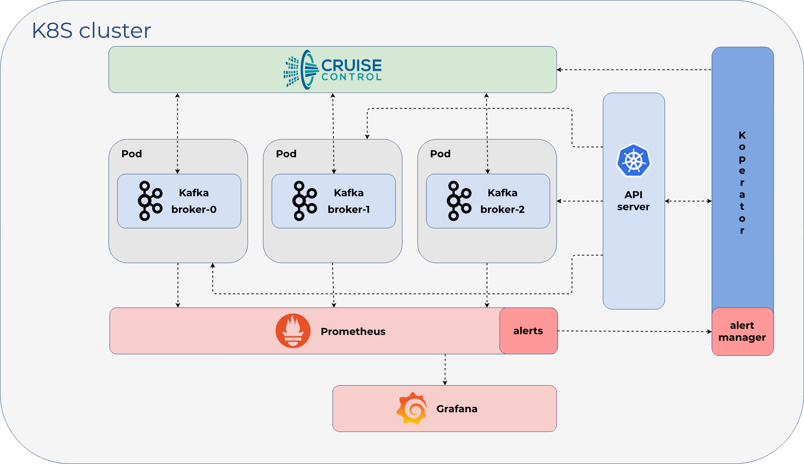

The Banzai Cloud Kafka operator is a Kubernetes operator to automate provisioning, management, autoscaling and operations of [Apache Kafka](https://kafka.apache.org) clusters deployed to K8s.

## Overview

[Apache Kafka](https://kafka.apache.org) is an open-source distributed streaming platform, and some of the main features of the **Kafka-operator** are:

- the provisioning of secure and production-ready Kafka clusters
- **fine grained** broker configuration support
- advanced and highly configurable External Access via LoadBalancers using **Envoy**
- graceful Kafka cluster **scaling and rebalancing**
- monitoring via **Prometheus**
- encrypted communication using SSL
- automatic reaction and self healing based on alerts (plugin system, with meaningful default alert plugins) using **Cruise Control**
- graceful rolling upgrade
- advanced topic and user management via CRD

>We took a different approach to what's out there - we believe for a good reason - please read on to understand more about our [design motivations](features/) and some of the [scenarios](scenarios/) which were driving us to create the Banzai Cloud Kafka operator.

{}

## Motivation

At [Banzai Cloud](https://banzaicloud.com) we are building a Kubernetes distribution, [PKE](/products/pke/), and a hybrid-cloud container management platform, [Pipeline](/products/pipeline/), that operate Kafka clusters (among other types) for our customers. Apache Kafka predates Kubernetes and was designed mostly for `static` on-premise environments. State management, node identity, failover, etc all come part and parcel with Kafka, so making it work properly on Kubernetes and on an underlying dynamic environment can be a challenge.

There are already several approaches to operating Kafka on Kubernetes, however, we did not find them appropriate for use in a highly dynamic environment, nor capable of meeting our customers' needs. At the same time, there is substantial interest within the Kafka community for a solution which enables Kafka on Kubernetes, both in the open source and closed source space.
>We took a different approach to what's out there - we believe for a good reason - please read on to understand more about our [design motivations](features/) and some of the [scenarios](scenarios/) which were driving us to create the Banzai Cloud Kafka operator.

Finally, our motivation is to build an open source solution and a community which drives the innovation and features of this operator. We are long term contributors and active community members of both Apache Kafka and Kubernetes, and we hope to recreate a similar community around this operator.
