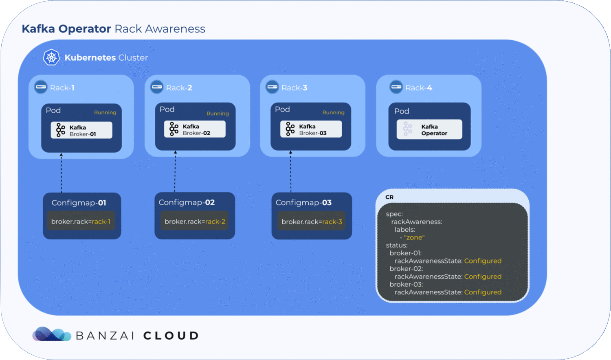

Kafka automatically replicates partitions across brokers, so if a broker fails, the data is safely preserved on another. Kafka's rack awareness feature spreads replicas of the same partition across different **failure groups** (racks or availability zones). This extends the guarantees Kafka provides for broker-failure to cover rack and availability zone (AZ) failures, limiting the risk of data loss should all the brokers in the same ack or AZ fail at once.

> Note: All brokers deployed by the Kafka operator must belong to the same Kubernetes cluster. If you want to spread your brokers across multiple Kubernetes clusters, as in a hybrid-cloud or multi-clouds environment (or just to add geo-redundancy to your setup), consider using our commercial [Supertubes](/products/supertubes/) solution.

Since rack awareness is so vitally important, especially in multi-region and hybrid-cloud environments, the [Kafka operator](https://github.com/banzaicloud/kafka-operator) provides an automated solution for it, and allows fine-grained broker rack configuration based on pod affinities and anti-affinities. (To learn more about affinities and anti-affinities, see [Taints and tolerations, pod and node affinities demystified]().)

When [well-known Kubernetes labels](https://kubernetes.io/docs/reference/kubernetes-api/labels-annotations-taints/) are available (for example, AZ, node labels, and so on), the Kafka operator attempts to improve broker resilience by default.



When the `broker.rack` configuration option is enabled on the Kafka brokers, Kafka spreads replicas of a partition over different racks. This prevents the loss of data even when an entire rack goes offline at once. According to the official Kafka documentation, "it uses an algorithm which ensures that the number of leaders per broker will be constant, regardless of how brokers are distributed across racks. This ensures balanced throughput.”

> Note: The `broker.rack` configuration is a read-only config, changing it requires a broker restart.

## Enable rack awareness

Enabling rack awareness on a production cluster in a cloud environment is essential, since regions, nodes, and network partitions may vary.

To configure rack awareness, add the following to the **spec** section of your KafkaCluster CRD.

```yaml
  rackAwareness:
    labels:
      - "topology.kubernetes.io/region"
      - "topology.kubernetes.io/zone"
  oneBrokerPerNode: false
```

- If `oneBrokerPerNode` is set to `true`, each broker starts on a new node (that is, literally, one broker per node). If there are not enough nodes for each broker, the broker pod remains in `pending` state.
- If `oneBrokerPerNode` is set to `false`, the operator tries to schedule the brokers to unique nodes, but if the number of nodes is less than the number of brokers, brokers are scheduled to nodes on which a broker is already running.

Most cloud provider-managed Kubernetes clusters have `well-known` labels. One well-known label is [topology.kubernetes.io/zone](https://kubernetes.io/docs/reference/labels-annotations-taints/#topologykubernetesiozone). Kubernetes adds this label to the nodes of the cluster and populates the label with zone information from the cloud provider. (If the node is in an on-prem cluster, the operator can also set this label, but it’s not strictly mandatory.)

On clusters which do not have well-known labels, you can set your own labels in the CR to achieve rack awareness.

Note that depending on your use case, you might need additional configuration on your Kafka brokers and clients. For example, to use follower-fetching, you must also set **replica.selector.class: org.apache.kafka.common.replica.RackAwareReplicaSelector** in your KafkaCluster CRD, and set the **client.rack** option in your client configuration to match the region of your brokers.

## Under the hood

As mentioned earlier, `broker.rack` is a read-only broker config, so is set whenever the broker starts or restarts. The Banzai Cloud [Kafka operator](https://github.com/banzaicloud/kafka-operator) holds all its configs within a ConfigMap in each broker.
Getting label values from nodes and using them to generate a ConfigMap is relatively easy, but to determine where the exact broker/pod is scheduled, the operator has to wait until the pod is *actually* scheduled to a node. Luckily, Kubernetes schedules pods even when a given ConfigMap is unavailable. However, the corresponding pod will remain in a pending state as long as the ConfigMap is not available to mount. The operator makes use of this pending state to gather all the necessary node labels and initialize a ConfigMap with the fetched data. To take advantage of this, we introduced a status field called `RackAwarenessState` in our CRD. The operator populates this status field with two values, `WaitingForRackAwareness` and `Configured`.


## When a broker fails

What happens if a broker fails? Will Kubernetes schedule it to a different zone? When a pod fails, the operator fetches all the available information from the node(s) - including zone and region - and tries to place it back into the zone it was previously in. If it can’t, the pod remains `pending`.

To manually override this and schedule the broker into a different zone or region, set the `broker.rack` config to the location of the broker node.
